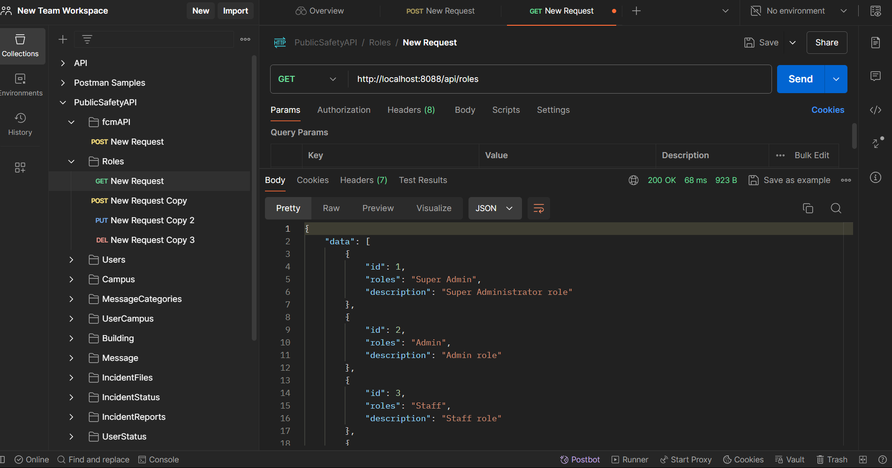

Project Documentation: Laravel 11 Public Safety App Backend API with Firebase Integration

Project Overview
This project is a backend application developed using Laravel 11 with Sail as the development environment. It serves as the API provider for an application, utilizing PostgreSQL as the database and integrating Firebase Cloud Messaging (FCM) for real-time notifications. The project is fully containerized using Docker to ensure a consistent development and deployment environment.

1. Project Setup
    The project is built using Laravel 11 with Sail for a seamless development environment. Docker is used for containerization, and PostgreSQL serves as the database management system.

Prerequisites
- Docker
- Composer
- Laravel Sail
- Firebase project and service account for FCM
- Initial Setup

Clone the repository:
bash
Copy code
git clone https://github.com/yourusername/backend-laravel-api.git
cd backend-laravel-api
Install dependencies:

bash
Copy code
composer install
Start Sail:

bash
Copy code
./vendor/bin/sail up -d
Generate the application key:

bash
Copy code
./vendor/bin/sail artisan key:generate

2. Development Environment
Technologies Used:

PHP 8.x
Laravel 11
Laravel Sail (Docker-based environment)
PostgreSQL as the database
Firebase Cloud Messaging (FCM) for notifications
Tools:

Visual Studio Code (VS Code)
Postman for API testing
Docker for containerized environment management

4. Key Features
RESTful API Endpoints: CRUD operations for various resources.
Firebase Integration: Send notifications to client devices.
PostgreSQL Database: Manage and persist data securely.
Docker Support: Containerized setup for easy deployment and scalability.

# safetyBackend
# safetyBackend
# safetyBackend
